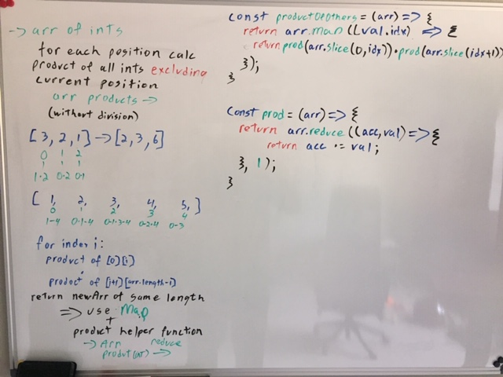
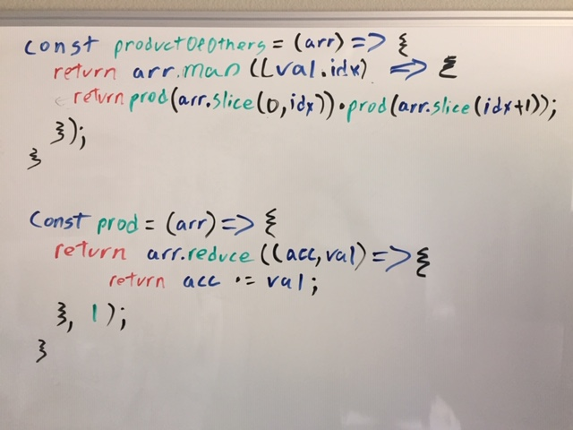

Challenges
=================================================


### Author: Jared Pattison

### Links and Resources

- These DSA classes are my TypeScript implementations of pseudocode found in [Data Structures and Algorithms: Annotated Referene with Examples - First Edition](http://www.freetechbooks.com/dotnetslackers-p1936.html)  
Granville Barnett and Luca Del Tongo 2008  
- Challenges folder contains JavaScript Code Challenges from Code Fellows 301 complete with jest tests
  - Challenge 1: string, array, forEach
  - Challenge 2: string, array, obj
  - Challenge 3: sort
  - Challenge 4: regex
  - Challenge 5: slice, splice, split, regex
  - Challenge 6: forEach, objects
  - Challenge 7: loops, map
  - Challenge 8: filter
  - Challenge 9: reduce
  - Challenge 10: reduce, map
  - Challenge 11: regex
  - Challenge 12: 2D arrays
  - Challenge 13: map, filter, reduce, regex
  - Challenge 14: reduce, objects, 2D arrays
  - Questions: random interview javaScript question and tests

### Testing
All testing was done with Jest: 
* [Jest docs](https://jestjs.io/docs/en/getting-started)

## White Board Images
#### productOfOthers: 
Question compliments of asdFletcher  

Located in [questions](./questions.test.js) file, lines 40 - 60 with test around line 122  
```
Get product of all other elements

Given an array of integers, return a new array such that each element at index i of the new array is the product of all the numbers in the original array except the one at i.

For example:
[1, 2, 3, 4, 5] --> [120,60,40,30,24]
[3,2,1] --> [2,3,6]

The follow up question is, can you do this without division?  
```



