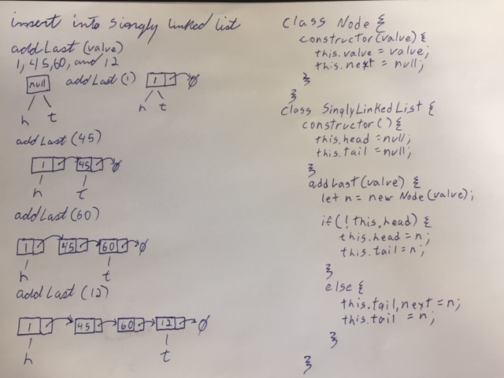
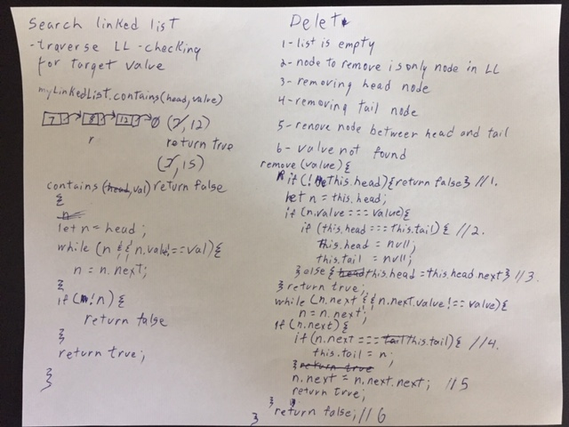

Singly Linked Lists
=================================================
## Author: Jared Pattison
--- 
---
## Notes
This implementation maintains a pointer to the tail
## Methods
- `add(value)`
  - Defaults to addLast
- `isEmpty()`
  - Returns true if list is empty, false otherwise
- `addLast(value)`
  - Takes a value as a parameter and adds a new node with that value to the end (tail) of the linked list
- `addFirst(value)`
  - Takes a value as a parameter and adds a new node with that value to the start (head) of the linked list
- `addAfter(value, target)`
  - Takes a value and a target as parameters and adds a new node with the provided value after the node with the target value
- `addBefore(value, target)`
  - Takes a value and a target as parameters and adds a new node with the provided value Before the node with the target value
- `contains(value)` 
  - Takes a value as a parameter and returns true if that value is found in the list, false if it is not
- `toArray()`
  - Returns array with all node values in list
- `toReverseArray()`
  - Returns array with all node values in reverse order
- `removeLast()`
  - removes last node (tail), returns false if list is empty
- `removeFirst()`
  - Removes first node (head), returns false if list is empty
- `remove(value)`
  - Takes a value as a parameter and removes the first node found with the matching value - returns false if no node with matching value is found or list is empty
- `print()`
  - Takes no parameters, console logs the value of each node in the list
- `printArray()`
  - Takes no parameters, console logs an array with the value of each node in the list
- `printObject()` (not currently working with TS)
  - Takes no parameters, console logs the list as an object
## White Board Image
### addLast:

### contains, remove

## Testing
Tests are written for the singlyLinkedList class methods and can be found here:  
```
singlyLinkedList\__tests__\singly-linked-list-test.js
```
One of the printObject tests has been commented out as it passes locally but fails is Travis for an unkown reason 
All print method tests commented out as Jest mocks are not working with TS